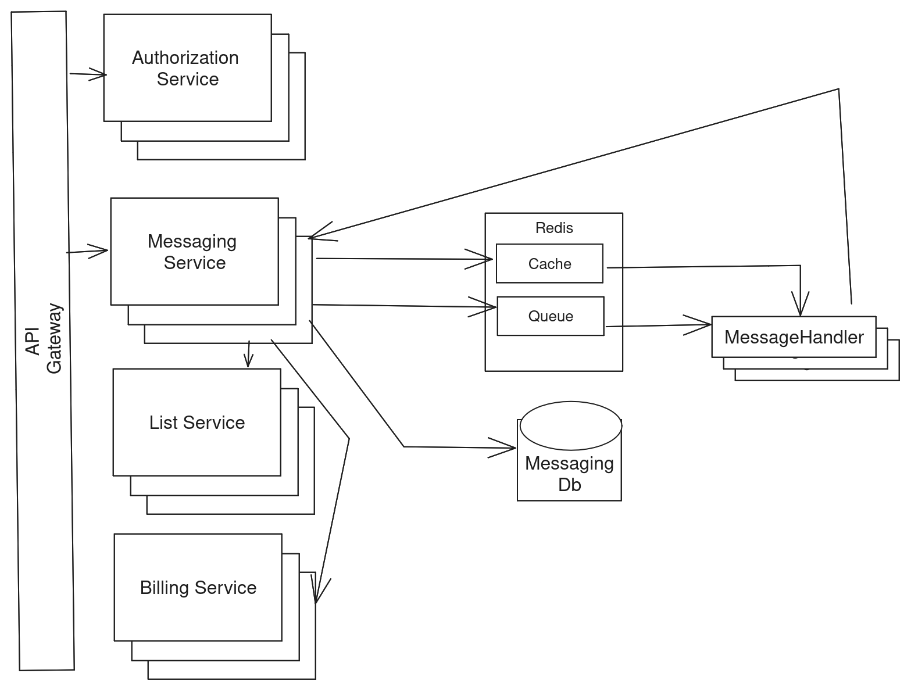
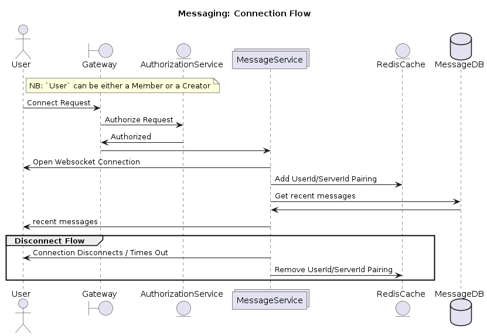
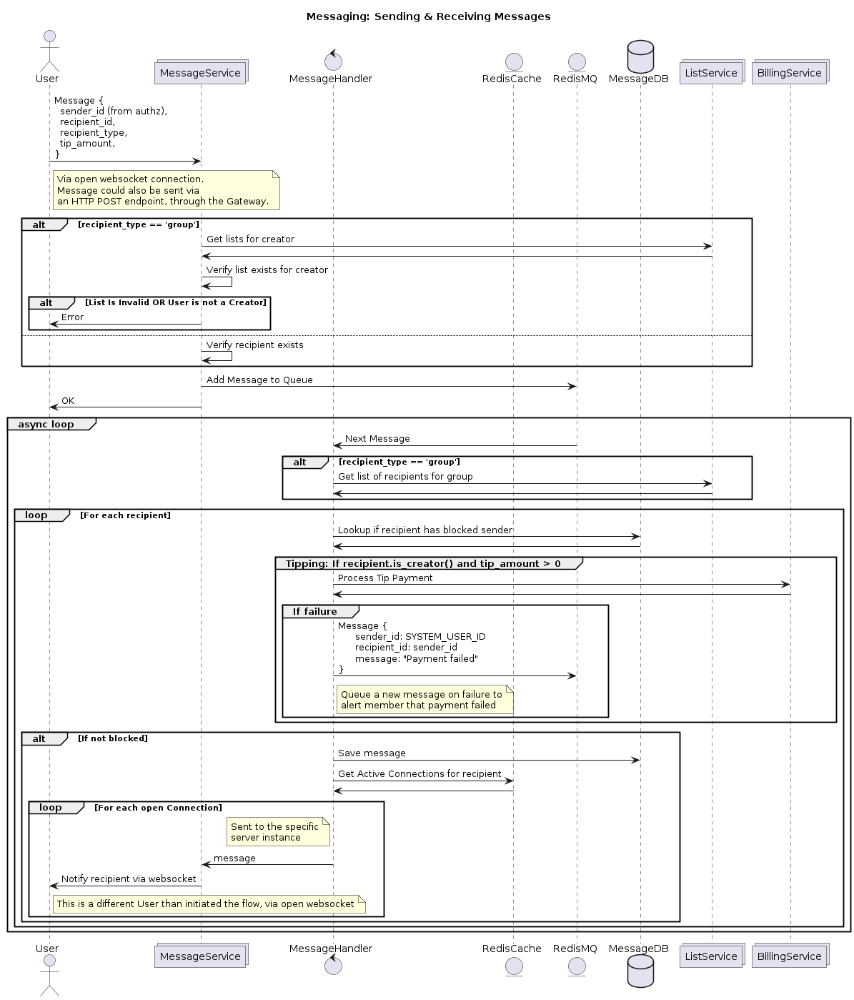

# Design Proposal: Messenger Feature

This design outlines an approach for a chat application supporting real time and
asynchronous messaging. The high level components are:

- API Gateway & Authorization Service - authorizes the user's credentials. For
  an unauthenticated user, or a revoked / unauthorized credentials token, it is
  assumed there is an existing login service we can redirect the user to.

- Messaging Service - The primary service for opening and persisting a chat
  connection. This is a load-balanced backend service (e.g. NodeJS), deployed
  via a Docker container to an EC2 cluster (or similar).

- List Service - Existing service to provide group messaging lists.

- Billing Service - Existing service to process payments.

- Redis Instance - Used as (1) a cache for tracking which users have active
  connections, and which specific server instances they are connected to. Also
  used as (2) a message queue for processing incoming messages.

- MessageHandler - An asynchronous task handler to process messages and tips,
  and to deliver them to the intended recipients.

- MessagingDB - A SQL database to store the messages and related data. This
  design requires two primary tables:
  1. A `messages` table to store the historical record of messages between
     users. This could include metadata such as read status, read_date, etc.
  2. A `blocked_users` table to track recipients that have blocked specific
     senders.

## Real Time Chat

To achieve a real time chat, we will utilize WebSockets, Redis, and an
asynchronous task processor.

### Initiating a Connection

When a user connects from the application (e.g. React application), the Gateway
authorizes the connection via the provided credentials, forwards the request to
an available MessageService instance, and opens the WebSocket connection.

Once the WebSocket connection is open, the MessageService stores an identifier
in a shared Redis cache, so that new incoming messages can locate the server
instance with the active connection.

Recent messages are loaded from the DB, and sent to the user over the newly
established connection.

When the connection is terminated, the server instance removes the stale entry
from the Redis cache.

### Sending Messages

A message is sent via the open WebSocket connection (or via an HTTP endpoint) to
the MessageService. The MessageService does basic filtering steps, such as (a)
ensuring the recipient exists, and (b) ensuring the user is sending to a valid
list belonging to them, if the user is a creator. It is then sent to a queue to
be picked up by the async task processor, MessageHandler.

The MessageHandler will verify the recipient has not blocked the sender, store
the message in the database, and notify the user by routing the message through
MessageService via all active websocket connections.

## Offline messaging

We achieve offline messaging by storing the messages in a relational database
(e.g. MariaDB), indexed on `recipient_id`, `sender_id`, and `sent_date`. This
step is taken regardless of whether a message is sent, so that messages are not
lost when a user closes the app. When a user logs in, they will receive all
unread messages after the connection is established.

Messages could also be retrieved without engaging in live chat, via an HTTP
endpoint that queries the MessageDB (not represented in diagram).

ref: See the Sending Messages sequence diagram above.

Out of Scope: Email, SMS, or other notifications could be sent when an offline
user recieves a message by sending a notification after storing the new message
in the database.

## Mass messaging

Mass messaging is achieved through the same flow as individual messaging, with
two added steps: When the message is sent, before being queued for processing,
authorization checks are made against the sender and recipient list. The
MessageHandler expands the list of recipients, and sends the message to each
recipient via the MessageService instance with the active websocket connection.

ref: See the Sending Messages sequence diagram above.

## Tipping

When a member tips a creator, it can be sent through the active websocket
connection or via an HTTP endpoint. The request is made to the billing service -
on success, the creator is notified with a message via the existing message
flow. On failure, the member will receive a message with a link redirecting them
to the Billing preferences to update their payment information.

It is assumed that tipping will be sent through the messaging flow, and that
tips may include a message. An optional "tip amount" attribute is added to the
request, and processed through the Billing service if it is nonzero.

ref: See the Sending Messages sequence diagram, this flow is outlined in the
async loop section when processing messages.

## Blocking

A user can block another user through an API call, which updates a
`blocked_users` table in the MessageDB. Messages sent to a blocked user will not
be processed. It is assumed that the user will not be notified that their
messages are blocked, they will just be sent into the void.

To notify the user that their message has been blocked, we could instead do the
block lookup when the message is received, before queueing it for processing.

Note: Blocked messages may be logged for investigative purposes and to prevent
abuse. An alternate approach could also store the messages with a flag
indicating it was blocked. Those messages would not be sent to the recipient,
and would be filtered out when retrieving messages from MessageService (not
represented in diagram)

## Additional Considerations

- Integration tests and unit tests should be written as a part of the
  implementation.
- All services should include a Dockerfile with a release build.
- Infrastructure as Code (IaC) scripts should be written todefine the
  infrastructure and deployments.
- CICD workflows should be included to Build, Test, Release, and Deploy.
- Basic security controls are handled with the Authorization service and API
  Gateway, but more rigor and testing may be required.
- As traffic grows, to reduce strain on the primary DB an additional Redis cache
  could be added to cache frequently accessed data, such as block lists for
  high-traffic creators, messages for frequent users, or messages sent to very
  large groups.

[Copyright Nik Gilmore 2024 All Rights Reserved]
